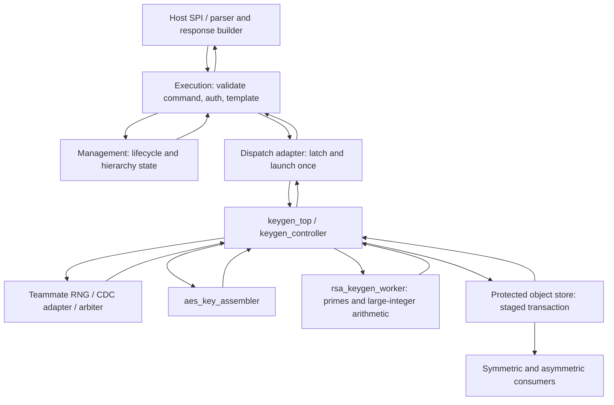

# Key Generation: architecture and interface outline

**Draft proposal, 2026-09-30. Documentation only: no HDL modules, cryptographic algorithms, keys, or new connected logic are implemented by this change.** All names and widths below are intended interfaces for review, not existing ports. No success-producing stub is provided.

Aaron owns all key generation; a teammate supplies RNG. RSA-2048 is user-confirmed scope. AES-256 is intended, but formal team AES sizes remain unconfirmed. Aaron accepted **32-bit RNG data as a working input assumption**, not a final team contract. Protocols, byte order, error handling, storage, RSA exponent and module partitioning remain proposals.

Canonical running memory stays **outside this repository**, in the class workspace `AI/KEY_GENERATION_SPEC.md`. Stable IDs below refer to that document; their definitions here make this outline self-contained. This file is a proposed architecture snapshot for review, not a copy of the living specification.

## Proposed connections

Solid arrows in this diagram describe proposed connections only; none are added to `TPM_TOP.v` in this PR.

Management does not receive raw private keys and does not start generation through its misleadingly named `keyStart_n`. Execution validates policy/template and owns command response formatting. The store owns objects, access control and hierarchy lifetimes. AES round-key expansion/encryption remains in the symmetric engine.

| Proposed module | Responsibility | Complete intended boundary |
| --- | --- | --- |
| `keygen_top` | Wiring wrapper for controller and two workers; no arithmetic itself | External ports in the next table |
| `keygen_controller` | Latch one request, choose worker, route RNG/results, enforce lifecycle, stage/commit/abort storage, return one status | All `keygen_top` external ports plus two worker bundles below, with controller directions opposite to worker directions |
| `aes_key_assembler` | Assemble eight accepted words for AES-256; no cipher/expansion | One worker bundle, supporting only AES initially |
| `rsa_keygen_worker` | Generate/check candidates and compute RSA components | One worker bundle, supporting only RSA-2048 initially |
| Dispatch adapter (future execution logic) | Convert held execution enable into one accepted request; retain status until execution acknowledges; supervise health | System, request, cancel, status and health bundles of `keygen_top`; inherited command/status signals described in integration plan |

RSA candidate filtering, primality testing and big-integer arithmetic are internal worker responsibilities. Their decomposition/operand microinterfaces are deferred until the algorithm is selected; no extra arithmetic module ports are claimed here.

## External port inventory: proposed `keygen_top`

`I`/`O` are relative to keygen. Every signal is synchronous to `clock` at this boundary except reset assertion. All widths/encodings are proposals. The keygen boundary carries validated internal descriptors, not raw TPM commands or a complete TPM template.

| Bundle | Port | Dir | Width | Meaning |
| --- | --- | --- | --- | --- |
| System | `clock` | I | 1 | Rising-edge boundary clock; frequency undecided |
| System | `reset_n` | I | 1 | Proposed active-low reset; async assertion, synchronized release per domain |
| Health | `health_fault`, `health_status` | O | 1, 8 | Sticky subsystem fault plus internal reason; execution supervises recovery separately from immutable request response |
| Request | `req_valid`, `req_ready` | I, O | 1 each | Accept one request on valid/ready transfer |
| Request | `req_id` | I | 32 | Correlation token, unique until status consumed and transaction retired |
| Request | `req_alg` | I | 2 | Proposed `1=AES`, `2=RSA`; others rejected |
| Request | `req_key_bits` | I | 12 | `256` AES or `2048` RSA; other sizes rejected initially |
| Request | `req_mode` | I | 2 | Proposed `0=fresh-random`; other modes rejected, including primary derivation |
| Request | `req_context` | I | 32 | Opaque reference to validated immutable template/policy/parent/hierarchy context, pinned by execution/store until retirement |
| Request | `req_destination` | I | 32 | Opaque pre-reserved protected object slot; allocator/format unresolved |
| Request | `req_public_exponent` | I | 32 | RSA `65537` only in this proposed version; AES uses zero |
| Cancel | `cancel_valid`, `cancel_ready` | I, O | 1 each | Matching pre-commit cancellation transfer; no accepted cancel after commit request accepted |
| Cancel | `cancel_id` | I | 32 | Must match the active request |
| Status | `busy` | O | 1 | Active from request acceptance through cleanup and status acknowledgment |
| Status | `rsp_valid`, `rsp_ready` | O, I | 1 each | Stable terminal status retained until acknowledgment |
| Status | `rsp_id` | O | 32 | Latched request token |
| Status | `rsp_status` | O | 8 | Internal status enum, mapped to TPM code by execution; values to agree |
| Status | `rsp_object` | O | 32 | Protected object reference valid only with success; zero on error |
| RNG | `rng_data` | I | 32 | Cryptographically suitable generator/conditioned output, not raw unqualified entropy |
| RNG | `rng_valid`, `rng_error`, `rng_ready` | I, I, O | 1 each | Word stream and failure indication |
| Store begin | `store_begin_valid`, `store_begin_ready` | O, I | 1 each | Open one staged transaction before output data is accepted |
| Store begin | `store_begin_id`, `store_begin_context`, `store_begin_destination` | O | 32 each | Latched transaction/context/destination references |
| Store begin | `store_begin_alg`, `store_begin_key_bits` | O | 2, 12 | Expected object manifest selector |
| Store data | `store_data_valid`, `store_data_ready` | O, I | 1 each | Protected stream transfer |
| Store data | `store_data_id` | O | 32 | Transaction token |
| Store data | `store_data_word` | O | 32 | Key component word; never routed to management, LEDs or host plaintext |
| Store data | `store_data_component` | O | 4 | Component code below |
| Store data | `store_data_index` | O | 7 | Zero-based word offset within component (up to 63 used) |
| Store data | `store_data_bits` | O | 12 | Component bit length, constant throughout component |
| Store data | `store_data_last` | O | 1 | Last word of this component, not end-of-transaction |
| Store finalize | `store_finish_valid`, `store_finish_ready` | O, I | 1 each | Commit/abort transaction request |
| Store finalize | `store_finish_id`, `store_finish_abort` | O | 32, 1 | Token and `1=abort`, `0=commit` |
| Store response | `store_rsp_valid`, `store_rsp_ready` | I, O | 1 each | Final transaction acknowledgment, retained until accepted |
| Store response | `store_rsp_id`, `store_rsp_status`, `store_rsp_object` | I | 32, 8, 32 | Matching token, commit/abort outcome, object reference on successful commit |
| Store fault | `store_error` | I | 1 | Active transaction failure (including begin/data phases); prevents success |
| Store recovery | `store_available` | I | 1 | Store has reconciled reset/commit state and permits new transactions; required before request ready |

There is no raw `aes_key[255:0]` or `rsa_private_key[2047:0]` external port. One protected 32-bit component stream avoids huge parallel buses and defines placement/size explicitly. Storage must validate exact component counts/manifest before committing. A transferred word is only staged; it is not a completed object.

## Worker port inventory

Identical control/stream shape for each worker, with different legal algorithm and component sets. `I`/`O` are relative to the worker. Controller applies one bundle only to the selected worker and suppresses RNG readiness on the inactive worker. No request queue is proposed.

| Port | Dir | Width | Meaning |
| --- | --- | --- | --- |
| `clock`, `reset_n` | I | 1 each | Same boundary clock/reset |
| `work_valid`, `work_ready` | I, O | 1 each | One accepted operation; controller does not replay it |
| `work_id`, `work_public_exponent` | I | 32 each | Token and exponent (zero for AES) |
| `work_key_bits` | I | 12 | Latched size |
| `work_cancel` | I | 1 | Latched abort level, retained until cleanup status accepted |
| `rng_data`, `rng_valid`, `rng_error`, `rng_ready` | I, I, I, O | 32, 1, 1, 1 | Same accepted-word protocol as external RNG |
| `out_valid`, `out_ready` | O, I | 1 each | Protected component stream to controller |
| `out_id`, `out_word` | O | 32 each | Token and component word |
| `out_component`, `out_index`, `out_bits`, `out_last` | O | 4, 7, 12, 1 | Same component metadata as storage stream |
| `done_valid`, `done_ready` | O, I | 1 each | Stable terminal worker status/cleanup acknowledgment |
| `done_id`, `done_status` | O | 32, 8 | Token and status; never means storage commit |

Worker success follows acceptance of every output beat and clearing local secret intermediates. Cancel/error stops output, clears local material, and returns error only after cleanup. Controller waits for worker cleanup AND store rollback before completing a failed transaction. Clear-only behavior is not implemented by this documentation.

### Component manifest and ordering proposal

| Code | Component | Bits | 32-bit words | Visibility |
| --- | --- | --- | --- | --- |
| 1 | AES key | 256 | 8 | Secret |
| 2 | RSA modulus `n` | 2048 | 64 | Public only through authorized object-response path |
| 3 | RSA exponent `e` | 32 | 1 | Public; proposed 65537 |
| 4 | RSA private exponent `d` | 2048 padded | 64 | Secret |
| 5, 6 | RSA primes `p`, `q` | 1024 each | 32 each | Secret; conditional CRT/internal-storage profile |
| 7, 8, 9 | CRT `dP`, `dQ`, `qInv` | 1024 padded each | 32 each | Secret; conditional CRT profile, define `qInv = q^-1 mod p` |

Initial proposed profile: AES emits code 1; RSA emits 2, 3, 4 in order (129 words). CRT components 5 through 9 are reserved, **not emitted until the consumer/storage contract is agreed** (full CRT profile would total 289 words). This is an internal transport format, not a TPM wire-format or private-blob specification. Store begins with the agreed alg/size profile; changing CRT profile requires a versioned manifest/descriptor change before implementation.

For each component, index 0 holds its most significant 32 bits and indexes increase toward least significant bits; highest byte within a word serializes first. `last` is asserted exactly at `bits/32 - 1`. No partial words in the initial profile. AES follows first RNG word into key bits `[255:224]`. One raw 1024-bit RSA candidate consumes 32 accepted RNG words before shaping/checking; rejected candidates consume fresh words, so total consumption is variable. Numerical equality of successive RNG words is legal. RSA candidate-to-component algorithms, prime constraints, exact modulus-size enforcement and compliance procedure are not selected.

## Proposed transaction rules

1. **Clock/reset (IF-05, OPEN-02):** CDC FIFOs/adapters and reset synchronization are required if peers are in different domains. Current top's 50 MHz connection is evidence, not the new board/frequency decision. Reset suppresses all valid/ready transfers and invalidates pending status; clear local buffers/counters. Store independently invalidates uncommitted staging on reset and reconciles any accepted commit before accepting new work. Reset does not erase already committed objects. Cleanup guarantees require later hardware verification.
2. **Latch/rearm (REQ-03):** accept when `req_valid && req_ready`. Producer holds descriptor stable while pending; latch the whole descriptor, not live command wires. After acceptance, `req_ready=0` until terminal status consumed, cleanup complete AND a sampled low `req_valid` has rearmed the interface. A permanently held valid/start cannot launch twice. Adapter tracks request sent and status consumed for each command; it must also retire/rearm its inherited held `command_start`/`keygen_enable`. Invalid descriptors return unsupported/bad-request error without RNG consumption or storage writes.
3. **RNG (IF-01..04, REQ-02/05):** accept a word on a rising edge iff `rng_valid && rng_ready && !rng_error`, outside reset/cancel/fault. While valid and stalled, RNG holds data/valid stable except on error/reset. Selected worker counts accepted words; no fixed-rate assumption. RNG owns readiness, seeding and health. Arbitration must ensure words are owned by one consumer, including existing dispatcher RNG uses. Keygen cannot establish cryptographic suitability merely by counting words.
4. **Streams:** metadata/data are stable while valid and not ready, except reset/accepted cancellation/fault invalidates the pending transaction. Matching IDs are checked at each boundary; unexpected store/worker responses cause a protocol fault, never success. Store and workers must not send stale acknowledgments after retirement. Token reuse across reset is blocked until recovery drains/invalidates stale traffic.
5. **Staging (REQ-04):** reserve/pin destination/context before accepting request. Open store transaction, then launch the selected worker; send complete agreed manifest, then request commit only after worker success/cleanup. `store_begin_ready` means staging is available. `store_finish_ready` only accepts the finalize request; it is not commit success. Return success only after matching successful commit response and no previously latched fault. Failed begin/data/finalize reports error and requires acknowledged rollback of all accepted secret beats; rollback failure leaves subsystem unavailable until explicit recovery/reset reconciliation.
6. **Cancellation (REQ-01, OPEN-06):** `cancel_ready` is asserted only for matching active request before commit request transfer, outside reset/fault. An accepted cancel suppresses request, store-begin, worker-launch, RNG, output-data and commit transfers on that edge and latches abort. Fault suppresses those same normal transfers. Wait for cleanup acknowledgment only from a worker that actually accepted work; wait for store abort acknowledgment only if staging previously opened. If neither began, return cancelled after clearing local state. Thus no transaction or worker can be newly launched on the cancellation edge. Once commit request is accepted, cancellation is no longer accepted; execution must await outcome. Shutdown/hierarchy deletion blocks new requests, cancels pre-commit work or drains commit, then invokes storage lifecycle deletion if required. Caller withdraws unaccepted cancel on terminal status; cancel does not become a new command.
7. **Priority and completion:** reset, current/latched faults, accepted cancel, then normal transfers. Reset suppresses all transfers; fault/cancel suppresses normal transfers but allows subsequent cleanup/abort/status acknowledgments. Producers deassert normal valid signals (and consumers ready where appropriate) on fault/cancel so peers cannot count a transfer that keygen discarded. RNG/store error dominates worker success, even on the last RNG/output word; existing success-first checks must change. Once a commit request was accepted, storage must report a definite outcome. Before terminal publication (including its decision edge), a fault suppresses success and requires recovery/quarantine of a potentially committed object. At first assertion of `rsp_valid`, latch an immutable `rsp_id/status/object` until acknowledgment; a later fault cannot retract or rewrite that advertised result. Later faults instead block new work and require execution/storage health recovery independently of this response. A failure status is not proof that no durable object exists; recovery policy, health notification plumbing and host error mapping remain open integration gates. Errors stay latched until terminal acknowledgment; `rsp_object=0` on error. `busy` remains asserted through cleanup/status; no new request then. Reset is the explicit exception that invalidates an unacknowledged response.
8. **Timeouts and availability (OPEN-06):** no timeout/reseed/retry thresholds are fabricated here. Hung worker or store cannot turn into success. Production integration requires bounded or explicitly supervised recovery, clear status encodings, and a definition of when `req_ready` can be restored. Secret data must not escape via debug outputs.

In this outline, subsystem/protocol faults and any post-publication fault latch `health_fault/health_status`, suppressing new requests. Execution observes health independently of `rsp_valid`; recover by coordinated reset followed by `store_available` after storage reconciliation. No non-reset clear/reseed handshake is proposed yet. Ordinary unsupported-request/cancel results are transaction errors, not automatically fatal health faults; the classification of RNG/arithmetic/store failures and TPM failure-mode mapping must be agreed (OPEN-06). Suggested status names are SUCCESS, UNSUPPORTED, CANCELLED, RNG_FAILURE, ARITHMETIC_FAILURE, STORE_FAILURE, PROTOCOL_FAILURE and RECOVERY_REQUIRED; 8-bit encodings remain unassigned. Worker/store/keygen status mappings must preserve reason and cleanup outcome rather than equating nonzero with fatal TPM failure.

## Concrete future integration plan

Existing behavior below is observed on base `91759b2c98ccf0f0a1bf29012d9f5ec64d669b57`; the plan is not applied in this PR.

| Location | Observed mismatch | Proposed change and prerequisite |
| --- | --- | --- |
| [`TPM_TOP.v`](../TPM_TOP.v):88, 114-116, 133 | `initialized`, auth/parameter success and command completion are tied high; no keygen or dispatcher instance | Instantiate approved dispatcher/adapter/keygen and real RNG/store peers only when available; connect actual validation/completion. Never replace constants with stub success. Route EE initialized and validated authorization context instead of hardwired/direct parameter values. |
| [`Execution Engine/execution_engine.v`](../Execution%20Engine/execution_engine.v):152, 1038, 1245-1258, 1550-1554 | `execution_response_code` is a scalar; execute checks `command_done`, but default next-state IDLE causes exit if done is low; `command_start` is asserted in execute | Explicitly hold execute until terminal done/fail, then acknowledge and rearm. Widen response-code contract to 32 bits; latch dispatcher terminal errors/status. Adapter launches once, maps keygen terminal result to full response code, and drives command_done for terminal completion, including failures. Keep failure status distinct from successful completion. |
| [`Execution Engine/input_output_signal_structure.v`](../Execution%20Engine/input_output_signal_structure.v):106-108, 266-298, 583-590, 623-650 | `S_KEYGEN` has no incoming route; keygen enable is a held level, completion precedes fail; error response defaults to success elsewhere | Add supported creation-command decode only after validation/template coverage is agreed; enter launch/wait/terminal handling. Replace/extend enable-only interface with request/status/cancel handshake. Latch full error code, prioritize fail, define control_ack/response acknowledgment and rearm; do not feed worker done directly as command success. |
| Execution validation/unmarshalling:1123-1239, 1570-1572 | Creation command constants exist, but parameter processing is TODO; session-free progression stalls, auth/preprocessing transitions do not reliably wait for success, initialization predicate can accept rejected commands | Fix and independently test validation/state timing before launching crypto. Parse/validate complete command/template, authorize parent/hierarchy, reserve context/destination and pin them through completion. Reject unsupported algorithms/modes; do not route CreatePrimary into fresh-random path. Never set initialized from a rejected command. |
| [`Management Module/management_module.v`](../Management%20Module/management_module.v):88-96, 191-218, 390-470 | keyStart_n is general active-low command enable; progression is enable-gated and hierarchy update commits prior latched inputs; lifecycle/hierarchy state and executionEng_rc govern response; no key-store contract | Define one-command acceptance/update/ack timing rather than assume a one-cycle enable applies new hierarchy state. Preserve management responsibility. Execution consumes op_state/phEnable/phEnableNV/shEnable/ehEnable and startup_type/shutdownSave. Add command-valid/terminal-valid coordination to avoid stale EE code; define launch blocking and cancel/drain on reset/shutdown/hierarchy changes. No raw key ports or separate crypto-start on keyStart_n. Distinguish local generation failure from fatal TPM health failure; define self-test/initialization integration. |
| Management/top authorization plumbing | Top passes `.authHierarchy(commandParam[39:8])` and `.initialized(1'b1)` although EE has corresponding outputs | Review and route validated, latched context/initialized status with valid timing; do not treat arbitrary command parameter bytes as authorization evidence. Management overrides and execution response selection must retain correct priority. |
| Management reset/result priority:177-218, 295-319, 390-470 | Captured control state/reset coverage is incomplete; repeated-Startup result can be overwritten; combinational response sensitivity omits a read input | Reset all live control/status deterministically; use complete combinational sensitivity and one mutually exclusive response-priority path. Autonomous accepted-command progress and current validated result must precede lifecycle/object side effects. Preserve existing hierarchy rules as reference behavior, then test reset/repeated-command/error boundaries. |
| [`IO Interface/tpm_crb.v`](../IO%20Interface/tpm_crb.v):50, 553-581, 728 | 40-bit management-specific parameter extraction and fixed ten-byte response size | Introduce validated template/request context and actual response-buffer payload/length plumbing; expose public object data or authorized protected private blobs, not internal secret stream. Key generation alone cannot make TPM creation commands complete. |
| RNG/storage peers and board wrapper | No implemented RNG/key store in reviewed main; existing board wrappers disagree with planned DE25 board | Agree RNG arbitration/CDC/health and staged object-store contract first. Determine target board and resource/timing budget before implementation. Existing dispatcher RNG enable/size/done is not a 32-bit streaming connection. |

Minimal launch path after future approval: execution validation -> latched adapter -> keygen request -> one selected worker -> staged storage -> worker cleanup -> commit acknowledgment -> keygen status -> execution response mapping -> management response selection -> I/O post-processing. Any failure bypasses success and goes through cleanup/status mapping. The full TPM response may still need session/post-processing work after keygen reports successful storage.

## Traceability and review gates

| Canonical IDs | Meaning / outline coverage |
| --- | --- |
| SCOPE-01/02/03, DEC-01 | Aaron's ownership; RSA-2048 confirmed; AES-256 proposal; 32-bit RNG accepted assumption |
| DEC-02/03/04 | Shared controller/worker architecture; outline before algorithms; AES then RSA future milestones; exponent 65537 proposal |
| IF-01..06 | RNG width/protocol/health/CDC and proposed most-significant-word-first ordering |
| REQ-01..06 | Clear on error/reset, eight AES words, latch/no retrigger, committed-result completion, 32-word RSA candidate, independently validated RSA key |
| OPEN-01..07 | Command coverage/AES sizes, board/clocks, RNG arbitration, encoding/order, protected store/outputs, recovery/timeouts, RSA procedure/CRT ownership |
| OUTLINE-01 | This documentation-only module/port inventory and execution/management integration plan; proposed, not team-approved or implemented |

Before implementing: agree port/encoding/manifest and exception semantics with execution, management, RNG and storage owners; define primary-object derivation scope; approve RSA procedure and arithmetic profile. Unresolved decisions make this PR a draft, not an implementation-ready contract.

## Validation and authorship

AI-authored: Codex drafted this outline and performed repository analysis at Aaron's request. An independent AI tester reviews the final documentation diff; this is not a human/team approval. Aaron reviews the PR before any merge.

Validation is static/documentation review only. There is no new HDL to compile/elaborate/simulate and no functional crypto test result. Planned future checks trace to VER-01..09: accepted-word counts/order/stalls, legal repeated numerical words, error/reset/cancel priority, held start/rearm, staging rollback/commit acknowledgments, RSA retries/independent arithmetic checks and RNG/CDC assurance. See [REVIEW.md](REVIEW.md) for checks and resolved review findings.
